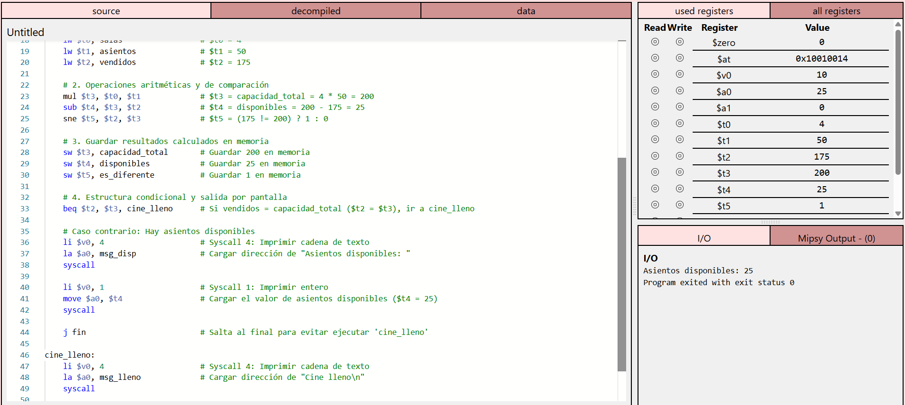
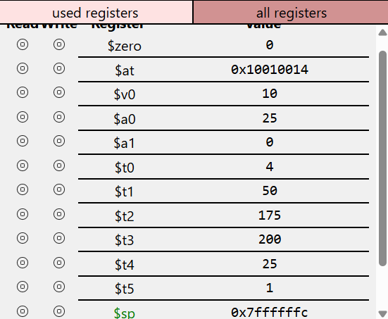
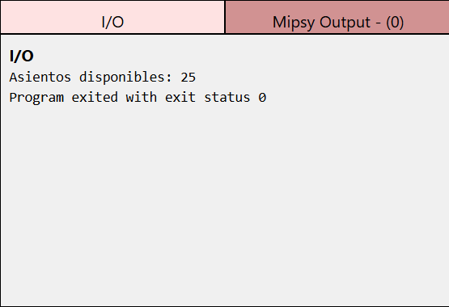

# Sistema de inventario y control de venta de boletos para un cine en MipsyWeb

**Asignatura:** UCOM250 – Organización y Arquitectura de Computadores  
**Integrantes:** Ricardo Perez, Eduardo Nogales  
**Año:** 2026  
**Fecha:** 03/10/2026

---

## Descripción

### Escenario

El proyecto plantea el control de disponibilidad de boletos para un cine mediante un programa desarrollado en lenguaje ensamblador MIPS y ejecutado en MipsyWeb.

El cine cuenta con **4 salas**, cada una con una capacidad de **50 asientos**, por lo que la capacidad total es de **200 asientos**. En el escenario asignado se han vendido **175 boletos**.

El programa debe utilizar los datos almacenados en memoria para calcular la capacidad total del cine, determinar cuántos asientos permanecen disponibles y mostrar el resultado correspondiente.

### Resultado

El programa debe calcular:

- Capacidad total del cine: **200 asientos**.
- Boletos vendidos: **175**.
- Asientos disponibles: **25**.

Si la cantidad de boletos vendidos es igual a la capacidad total, el programa debe mostrar:

```text
Cine lleno
```

En caso contrario, debe mostrar:

```text
Asientos disponibles: 25
```

---

## Análisis

### Datos del programa

Los datos principales se almacenan en memoria y representan la información necesaria para calcular la disponibilidad del cine.

| Dato | Valor inicial | Propósito |
|---|---:|---|
| Número de salas | 4 | Indicar cuántas salas tiene el cine |
| Asientos por sala | 50 | Indicar la capacidad de cada sala |
| Boletos vendidos | 175 | Registrar la cantidad de boletos vendidos |
| Capacidad total | 200 | Resultado de multiplicar salas × asientos por sala |
| Asientos disponibles | 25 | Resultado de restar boletos vendidos a la capacidad total |

### Operaciones requeridas

| Datos / Resultados | Propósito | Operación requerida | Instrucción MIPS |
|---|---|---|---|
| Número de salas | Cargar dato desde memoria | Carga | `lw` |
| Asientos por sala | Cargar dato desde memoria | Carga | `lw` |
| Boletos vendidos | Cargar dato desde memoria | Carga | `lw` |
| Capacidad total | Calcular la capacidad del cine | Multiplicación | `mul` |
| Asientos disponibles | Calcular los asientos restantes | Resta | `sub` |
| Comparación de capacidad | Determinar si el cine está lleno | Comparación | `sne` |
| Control de flujo | Seleccionar el mensaje que debe mostrarse | Salto condicional | `beq` |
| Resultados | Guardar valores calculados en memoria | Almacenamiento | `sw` |
| Mensajes | Cargar direcciones y valores para impresión | Preparación de salida | `la`, `li`, `move` |
| Flujo del programa | Evitar ejecutar bloques no correspondientes | Salto | `j` |
| Salida | Mostrar los resultados por pantalla | Impresión | `syscall` |

Instrucciones utilizadas en el programa:

- `lw`: cargar un dato desde memoria.
- `sw`: almacenar un resultado en memoria.
- `mul`: realizar una multiplicación.
- `sub`: realizar una resta.
- `sne`: determinar si dos valores son diferentes.
- `beq`: realizar un salto si dos valores son iguales.
- `li`: cargar un valor inmediato en un registro.
- `la`: cargar la dirección de una etiqueta.
- `move`: copiar el contenido de un registro a otro.
- `j`: realizar un salto incondicional.
- `syscall`: mostrar información por pantalla o finalizar el programa.

---

## Implementación

El código se organiza en una versión base y una versión final. La versión final contiene la solución completa del escenario y debe ejecutarse correctamente en MipsyWeb.

### Versión base

La carpeta `version_base/` debe contener el programa utilizado como punto de partida de la actividad.

**Archivo:**

```text
version_base/programa_base.s
```

> **PENDIENTE – ARCHIVO:** subir aquí el programa base proporcionado o utilizado al inicio del proyecto con el nombre `programa_base.s`.

**Descripción del estado inicial:**  
> **PENDIENTE:** completar esta breve descripción cuando se confirme qué contenía exactamente la versión base entregada por el docente.

### Versión final

La carpeta `version_final/` contiene el programa desarrollado por el grupo.

**Archivo:**

```text
version_final/programa_final.s
```

La versión final incluye:

- Carga de los datos almacenados en memoria mediante `lw`.
- Cálculo de la capacidad total mediante `mul`.
- Cálculo de los asientos disponibles mediante `sub`.
- Comparación de los boletos vendidos con la capacidad total.
- Uso de `sne` y `beq` para controlar el flujo del programa.
- Almacenamiento de los resultados mediante `sw`.
- Presentación del resultado por pantalla mediante `syscall`.
- Mensajes diferentes para los casos de cine lleno y asientos disponibles.
- Comentarios explicativos dentro del código.

> **ARCHIVO A SUBIR:** `version_final/programa_final.s`

---

## Evidencias de ejecución

Las siguientes capturas deben demostrar el código, el uso de registros y el resultado final en MipsyWeb.

### Código

> **PENDIENTE – IMAGEN:** subir una captura del código con el nombre:
>
> ```text
> evidencias/codigo.png
> ```



**Descripción:**  
### Registros

> **PENDIENTE – IMAGEN:** subir una captura de los registros con el nombre:
>
> ```text
> evidencias/registros.png
> ```



**Descripción:**  
La captura debe mostrar los registros relevantes durante o después de la ejecución. Se debe poder identificar el cálculo de la capacidad total (**200**) y de los asientos disponibles (**25**), según los registros utilizados por el programa.

### Resultado

> **PENDIENTE – IMAGEN:** subir una captura de la salida del programa con el nombre:
>
> ```text
> evidencias/resultado.png
> ```



**Descripción:**  
Para el escenario asignado, la ejecución debe mostrar que quedan **25 asientos disponibles**. Si se modifica la cantidad de boletos vendidos hasta igualar la capacidad total, el programa debe mostrar el mensaje **"Cine lleno"**.

---

## Conclusiones

El desarrollo del proyecto permitió aplicar de forma práctica conceptos de organización y arquitectura de computadores mediante programación en lenguaje ensamblador MIPS. La implementación ayudó a comprender cómo los datos almacenados en memoria son cargados a registros y posteriormente procesados mediante instrucciones aritméticas, de comparación y de control de flujo.

Una parte importante del trabajo consistió en traducir un problema sencillo de la vida real a operaciones básicas que puedan ser ejecutadas por el procesador. Calcular la capacidad total, determinar los asientos disponibles y seleccionar el mensaje correcto permitió observar cómo una secuencia de instrucciones MIPS construye el comportamiento completo de un programa.

También se reforzó el uso de MipsyWeb para comprobar el contenido de los registros y verificar que cada operación produjera el resultado esperado. La revisión paso a paso facilitó la identificación de errores y permitió relacionar de manera más clara las instrucciones escritas con los cambios producidos durante la ejecución.

Si se desarrollara nuevamente la actividad, sería conveniente planificar desde el inicio la distribución de los registros, documentar cada bloque conforme se construye y realizar pruebas con distintos valores, por ejemplo un cine con asientos disponibles y otro con su capacidad completamente ocupada.

---

## Documentación

El reporte completo del proyecto debe almacenarse en:

```text
documentacion/reporte_proyecto.pdf
```

> **PENDIENTE – ARCHIVO:** subir el reporte final en PDF con el nombre `reporte_proyecto.pdf` dentro de la carpeta `documentacion/`.

## Bibliografía

Las fuentes utilizadas para comprender las instrucciones MIPS, el funcionamiento del simulador y otros conceptos empleados en el proyecto deben registrarse utilizando **normas APA, séptima edición**.

### Ejemplos

#### Página web

```text
University of New South Wales. (n.d.). MIPS instruction set.
https://cgi.cse.unsw.edu.au/~cs1521/current/resources/mips-guide.html
```

#### Libro

```text
Patterson, D. A., & Hennessy, J. L. (2021). Computer organization
and design: The hardware/software interface (6th ed.). Morgan Kaufmann.
```

#### Documentación de software

```text
MARS. (s.f.). MIPS Assembler and Runtime Simulator.
http://courses.missouristate.edu/kenvollmar/mars/
```

### Referencias utilizadas

1. University of New South Wales. (s.f.). *MIPS instruction set*. https://cgi.cse.unsw.edu.au/~cs1521/current/resources/mips-guide.html

2. Patterson, D. A., & Hennessy, J. L. (2021). *Computer organization and design: The hardware/software interface* (6th ed.). Morgan Kaufmann.

3. MARS. (n.d.). *MIPS Assembler and Runtime Simulator*. http://courses.missouristate.edu/kenvollmar/mars/
